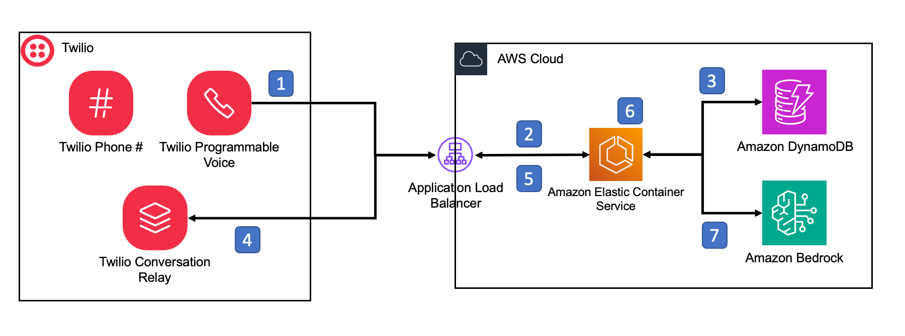

# ConversationRelay Architecture for Voice AI Applications Built on AWS using Fargate and Bedrock



This project can be used in three modes:

1. As a standalone development instance using a local Docker image.  
2. As a cloud-deployed server for production.
3. Run locally as a node application.

## Local Deployment

The local Docker instance will still need to call out to DynamoDB and Bedrock in the cloud.

When developing locally, you will need to supply a WSS and HTTPS endpoint for Twilio to reach your local machine.

We recommend ngrok.  

Start your ngrok enpoint and point it at your local machine on port 3000 (this is the default set for your local Docker image).

Copy the https and wss endpoints ngrok gives you.

Deploy Bedrock CloudWatch logs and cloud DynamoDB table for the application:

sam build --template-file local-dev-cloud-infra-template.yml
sam deploy --stack-name CR-local --template-file local-dev-cloud-infra-template.yml --guided

Modify the docker-compose.yml file on the following lines:

```
- INFERENCE_PROFILE_ARN=us.anthropic.claude-3-5-sonnet-20240620-v1:0
- TABLE_NAME=CR-local-ConversationRelayAppDatabase
- AWS_REGION=us-east-1
- STACK_USE_CASE=restaurantOrderingUseCase
- WS_URL=wss://<YOUR NGROK ENDPOINT>/
```

Then build your local Docker image, using `docker-compose build`.

And launch your local image `docker-compose up`.

Make sure that your Twilio phone number webhook endpoint is set to the HTTP address from ngrok.  

## Cloud Deployment

### Deploy your Docker image to your ECR repository

If you do not have an ECR repo, create one in the AWS region where you will deploy the app resources.  We use us-east-1 as a default here.

If you are using our build script `build-images.sh` you will need to modify the environment variables at the start of the script to reflect your environment:

```
ECR_REPO=971461683291.dkr.ecr.us-east-1.amazonaws.com
ECR_REPO_NAME=twilio-conversation-relay-bedrock-services
ECR_TAG=latest
```

### Deploy cloud resources to AWS

`sam build --template-file cloud-deploy-infra-template.yml`

`sam deploy --guided --stack-name CR-AWS-BEDROCK --template cloud-deploy-infra-template.yml --capabilities CAPABILITY_NAMED_IAM`

The first time you deploy, add `--guided` (`sam deploy --guided --stack-name...`) to the above command to generate a configuration file. All subsequent commands do not need the --guided.

You will need to provide the repo name you set in the above steps, and you will need to have a certificate, and custom domain set up for the load balancer deployment for your API endpoints.

### Configure your Twilio voice webhook endpoint

Take Output from the stack called "TwimlAPI" and assign it to the Webhook for Voice handler for their desired phone number.

### Load the application prompts and user profiles into Dynamo DB

`aws dynamodb put-item --table-name CR-AWS-BEDROCK-ConversationRelayAppDatabase --item "$(node ./configuration/dynamo-loaders/restaurantOrderingUseCase.mjs | cat)"`

First, edit this file [ ./configuration/dynamo-loaders/user-profile-example.json ] with your information. The primary key is the phone number in E164 format! 

`aws dynamodb put-item --table-name CR-AWS-BEDROCK-ConversationRelayAppDatabase --item "$(node ./configuration/user-profile.js | cat)"`